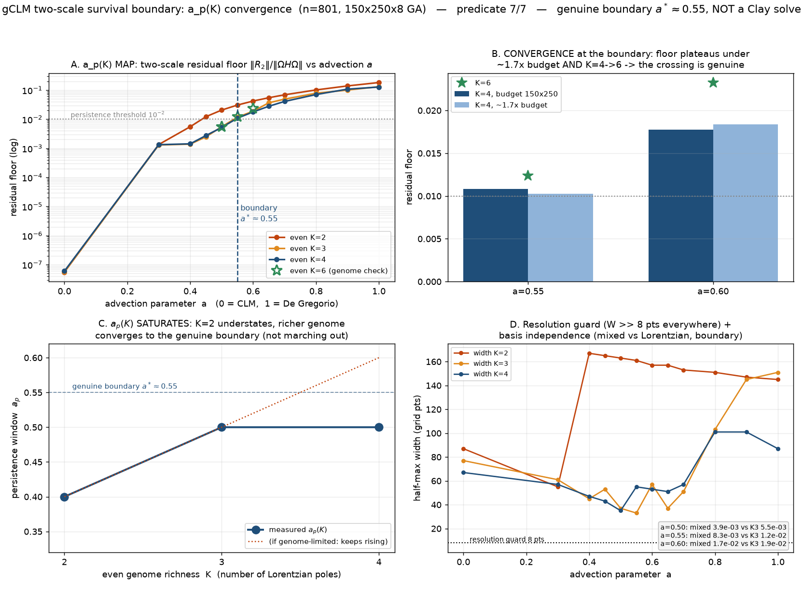

# We said the boundary was "soft." Was it real, or just our tool running out? We checked.

*Part of an honest, long-shot attempt at the Navier–Stokes blow-up problem. This
post is a sequel: last time we mapped a proven singularity as we turned on
advection, and admitted one number was suspect. Here we pin it down — and are just
as careful about what "pinned down" is worth. Still not a breakthrough. Still a toy
model.*

> **One scope note, added later (leg 180).** Everything below is measured at **positive** `a`.
> The published paper that proves a *two-scale* self-similar blowup **scenario** for this
> model family ([Huang–Tong–Wang, arXiv:2603.25104](https://arxiv.org/abs/2603.25104)) places
> that scenario at `a ≤ 0`, and reports *one-scale* blowups for `a > 0` — a statement about
> what **degenerate initial data** do. We are not continuing that scenario into `a > 0`. We
> are continuing one specific object into `a > 0`: the exact traveling-wave *profile* that
> sits at `a = 0`. That object exists at positive `a` in the published literature too (same
> paper, Theorem 2.7, for every `a` below 1). So when we say "the two-scale traveling wave
> survives to about `a ≈ 0.5`", read it as: *this `a > 0` continuation of the `a = 0` wave
> keeps fitting to about `a ≈ 0.5`.* The number below is unchanged; only its label is.

## The loose end

[Last time](BLOG_P2_TWO_SCALE.md) we took a *proven* two-scale singularity of the
CLM model — a bump that both races toward the origin and narrows, its shape a fixed
"traveling wave" — and asked what happens as you turn a knob `a` that adds
**advection**, sliding the model from CLM (`a=0`) toward the subtler De Gregorio
model (`a=1`). We let a genetic algorithm search for the best traveling-wave
profile at each `a` and measured how badly it fit. The answer: the wave doesn't
snap; it deforms smoothly, staying a good fit out to about `a ≈ 0.4`.

But we flagged one honest failure. That "`0.4`" was measured with a **simple**
family of profile shapes, and when we handed the search a **richer** family, the
fit at `a = 0.5` improved four-fold — jumping back over the "good fit" line. So the
boundary we'd drawn was **soft**: maybe the wave genuinely dies around there, or
maybe our profiles were just too crude to keep up and a better tool would push the
boundary further out. We couldn't tell. This post is us telling.

## The trap we had to avoid

The obvious move — keep enriching the profile family and watch where the boundary
settles — hides a trap. A genetic algorithm reports the *best fit it managed to
find*, and a richer family is a **harder search**. If we simply switched to fancier
profiles, an improving fit could mean "the wave really does survive further out"
**or** just "we threw more compute at a bigger haystack." Those look identical from
the outside.

We caught this in the act. At `a = 0.6`, doubling the search budget improved the fit
by **45%** — the number was tracking our *effort*, not the physics. Any conclusion
drawn at the old budget would have been noise.

So we did the boring, decisive thing first. We took a couple of points near the
boundary and pushed the budget *and* the profile richness hard — up to ~8× the
compute and a much larger family — and watched whether the fit **kept improving or
leveled off**.

It leveled off. Past a certain budget the best fit stopped moving, and making the
profile family richer stopped helping. That "leveling off" is the whole result:
it means the number we're about to quote is a property of the *equation*, not of how
hard we searched.

## What the sharpened map says

Now we can answer the loose end. We measured the survival boundary with families of
increasing richness (call it K = 2, 3, 4 "pieces"), each at the **converged** budget:

- **The simple family did understate it.** Its boundary was `0.40`; a richer family
  pushes it to `0.50`.
- **But it stops there.** Going richer still — more pieces, and a completely
  different *kind* of profile shape as a cross-check — **does not** push the boundary
  any further. It saturates at about **`a ≈ 0.5–0.55`** — a positive `a`, well inside the
  range we swept (`a = 0` up to `a = 1`).

That distinction is the point. If the boundary had kept sliding outward every time
we enriched the search, we'd have had to report defeat: "no real boundary here, our
tool just can't resolve it." Instead it converges. **On positive `a`, the continuation of
the `a = 0` two-scale traveling wave genuinely survives advection up to `a ≈ 0.5`, and
genuinely starts failing in the band `0.5–0.55`** — and beyond it degrades steadily to a
poor fit by the De Gregorio end, exactly as before. (What happens at `a ≤ 0` — the side the
published two-scale *scenario* lives on — we did not measure and do not claim.)

We ran three independent guards, and all three agree it's real: throwing more
compute at the boundary doesn't move it, adding more profile pieces doesn't move it,
and a structurally *different* profile family lands in the same place.

## The thing we won't oversell

The boundary is a **soft** crossing, not a cliff. Right at `a = 0.55` our different
profile families straddle the line — one just above the "good fit" threshold, one
just below. That's what the edge of a smoothly-worsening fit looks like; there's no
single magic `a*` where the wave vanishes. So the honest sentence is: *"survives to
about `0.5`, crosses the threshold around `0.5–0.55`, and that crossing is real
rather than an artifact of a lazy search"* — **not** *"dies at exactly `0.55`."*

## What it's worth

Same ceiling as always, said plainly: **a genetic algorithm minimizing a residual
proves nothing.** This is sharpened *evidence*, not a theorem. What it genuinely
buys us is twofold: it closes out the honest caveat from last time (the boundary was
soft; now we know it's a genuine, converged feature near `0.5–0.55`), and it hands
the next stage a much **better-justified starting guess** — the exact profile at
`a=0`, and the converged profiles right up to the boundary.

And that next stage is the one that actually matters. Everything so far lives on one
rung of a ladder: *a novel numerical map*. The rung above it — the first that counts
as genuine mathematics — is a **rigorous, computer-assisted proof** that one of
these profiles corresponds to a real singularity, certified by interval arithmetic
rather than a search. We haven't started it, and we're not going to pretend the
sharpened map is anything more than a good guess to feed it. But it's the next thing
we're building, and we'll be just as blunt about whether it works.
