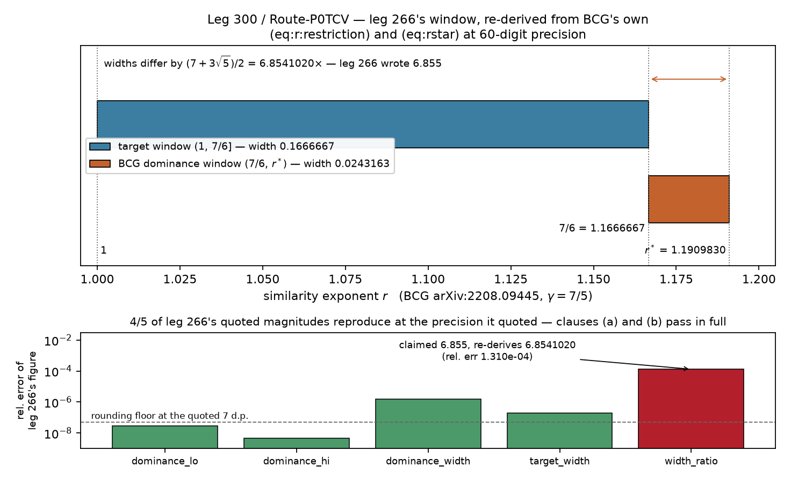

# The correction was right. One of its five numbers was not.

*Route-P0TCV (leg 300) — an independent verification of leg 266.*

## What was being checked

Some months of this project's Phase-0 work converge on a single sentence: what, exactly,
would a computer-assisted certificate for the Băculescu–Cao Labora–Gómez-Serrano (BCG)
imploding compressible Navier–Stokes profile have to *enclose*?

Leg 251 wrote that sentence down and got it slightly wrong. Its "obligation #1" asked for
an enclosure of *the self-similar profile system of the dissipative equation*. An
independent verifier (leg 251's review pass, `verify_251.md` §C) found the flaw: **at
BCG's scaling that system does not exist.** The stationary self-similar system BCG's
theorems solve is the *Euler* one — that is why the profiles are written `(U^E, S^E)` —
and dissipation never enters a stationary profile equation at all. It enters the
*dynamically rescaled* system as a non-autonomous forcing, `F_dis`, which BCG treat as an
error term only because a restriction on the similarity exponent `r` makes it decay.
Taken literally, leg 251's obligation would have sent the whole next phase after an
object that isn't there.

Leg 266 was cut to fix that one sentence. It re-posed obligation #1 onto **the stability
step, with `F_dis` retained, at `r` outside BCG's dominance regime**, reported GATE YES —
and then its session died before anyone checked its work. Leg 275 subsequently stacked a
further correction *on top of the unverified commit*. This leg is the missing check.

## The answer: gate NO, on one clause out of three, one magnitude out of five

**Clause (a) — does the re-posed obligation actually match the papers?** **Yes, in
full.** BCG's e-print was re-downloaded rather than inherited (md5
`45ea63c45a1a199ecfb4dc4a15431600`, 6898 lines of LaTeX — the *fourth* independent
download in this project to agree bit-for-bit), and all **10 of 10** line locators were
confirmed by eye. Theorem 1.3 does open on the Euler profiles "solving (eq:DS)" (l.220);
`F_dis` is defined at l.2130, sits on the right-hand sides at l.2138–2139, and the
authors do call it "the dissipative forcing" in those words at l.2142. All **3 of 3**
architecture sub-claims confirmed.

**Clause (b) — did the correction leave everything else alone?** **Yes, measured.**
Diffing the git objects directly, **29 of 29** verifier-confirmed claims are byte-identical
across the correction: the named candidate, obligations 2–5, the compressible-vs-Clay
flag, the Wall-2 statement, the conditional tier, the screen counts, the Clay odds. Five
files, nine hunks, **zero** paths outside leg 266's declared territory, **zero** shared
ledgers touched.

**Clause (c) — do the numbers re-derive?** **Four out of five.** Evaluating BCG's own
`(eq:rstar)` and `(eq:r:restriction)` at `γ = 7/5` in 60-digit arithmetic:

| quantity | leg 266 | re-derived | verdict |
|---|---|---|---|
| dominance window, lower edge | `1.1666667` | `1.1666666666…` | reproduces |
| dominance window, upper edge | `1.1909830` | `1.1909830056…` | reproduces |
| dominance window width | `0.0243163` | `0.0243163389…` | reproduces |
| target window width | `0.1666667` | `0.1666666666…` | reproduces |
| **ratio of the two widths** | **`6.855`** | **`6.8541019662…`** | **does not** |

The ratio has a clean closed form the project had never written down: it is exactly
`(7 + 3√5)/2 = 6.8541019662…`. Rounded to the four significant figures leg 266 quoted,
that is **6.854**. Leg 266 wrote **6.855** — an absolute error of `0.00090`, a relative
error of `1.310e-04`, about **0.013%**.

## Why a 0.013% error is still a gate NO

Because the gate was pre-committed, and pre-committed gates are not renegotiated once you
see how small the failure is. That is the entire point of writing them first.

But the honest report is not "leg 266 is wrong" — it is a *localised* finding, and this
leg localised it. Feed the comparator leg 266's **own** quoted endpoints and re-divide
them: you get 6.854 as well. So the formula leg 266 used is right, its inputs are right,
and only the final transcribed digit is wrong. **The defect is a slipped digit, not a
misread of the papers.** Clause (a)'s architecture reading and clause (b)'s
byte-untouchedness are entirely unaffected, and nothing downstream of the correction —
the re-posed obligation itself, the r-coverage requirement, leg 275's `r^(3)` re-naming —
depends on the ratio's fourth digit. The number is rhetorical: it is there to show the
target window is comfortably non-empty rather than a sliver, and it *is* comfortably
non-empty, by 6.854×.

The wrong figure has, however, already spread. A repository-wide search finds it on three
surfaces: leg 266's own journal (the source), `experiments/JOURNAL.md`, and
`DIRECTION.md`. Two of those are on `main` and outside this leg's territory, which is
precisely why the no-branch calls for a rework leg rather than a quiet in-place edit.

## What this does not mean

It does not mean the Phase-1 candidate is in doubt: the naming survived its own
verification pass and was never in scope here. It does not touch the Phase-1 packet
parked with the user. And emphatically, it moves nothing on the Clay chain — this is a
verification of the *wording and arithmetic of an obligation statement* for a
**compressible** Navier–Stokes target, and compressible Navier–Stokes is not the system
the Clay problem asks about. Clay odds stay ~0.05%.

What it *does* buy is the thing verification is for. Leg 266's correction can now be
relied on for its substance — 10/10 locators, 3/3 sub-claims, 29/29 claims byte-untouched
— and its one defective number is named, measured, closed-form-corrected, and handed on
with the three surfaces that carry it enumerated.

*Data: `writeup/data/p2_route_p0tcv_v1_verify.json`. Runner:
`experiments/p2_route_p0tcv_v1_verify.py`. Every number above is re-asserted from the
curated JSON by `experiments/p2_route_p0tcv_v1_verify_evidence.py` (26/26 checks), which
also re-derives the gate-answering ratio through a second, independent code path.*
