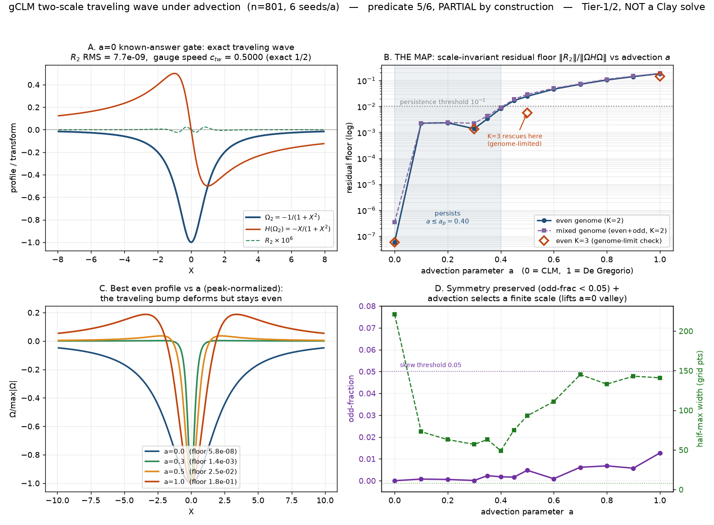

# Does a two-scale singularity survive when you turn on advection? Mapping a proven blowup with a genetic algorithm

*Part of an honest, long-shot attempt at the Navier–Stokes blow-up problem. This
post maps a real, novel question in a 1D toy model — and is careful about what the
map can and can't prove. It is not a breakthrough, and it caught its own limits.*

> **One scope note, added later (leg 180).** The knob `a` below is turned from 0 **upward**,
> to `a = 1`. Everything here is `a ≥ 0`. A later paper
> ([Huang–Tong–Wang, arXiv:2603.25104](https://arxiv.org/abs/2603.25104)) puts the *two-scale
> self-similar blowup scenario* on the other side of zero — at `a ≤ 0` — with `a > 0` giving
> **one-scale** blowups, for degenerate initial data. So we are not extending that scenario
> into positive `a`. We are taking the exact traveling-wave *profile* that sits at `a = 0`
> and asking how far into positive `a` it can be continued. That is a legitimate object at
> positive `a` — the same paper proves a traveling wave exists for every `a` below 1 — and
> it is the only thing the map below is about.

## A singularity that travels

Some finite-time singularities in fluid toy models are *self-similar*: zoom in on
the blowup point and the solution keeps its shape, just taller and thinner. In
2025, Huang, Qin and Wang proved something more exotic for the classic
Constantin–Lax–Majda (CLM) model — a **two-scale** blowup. Picture a bump that
races toward the origin at one rate while *narrowing* at a faster rate: two scales,
not one. Beautifully, they showed the bump's shape is an **exact traveling wave** —
a fixed profile sliding along, `Ω₂(X) = −1/(1+X²)`.

CLM is the gentle end of a family. Crank a knob `a` (the *advection* strength) from
0 up to 1 and you pass from CLM to the De Gregorio model, where the extra transport
term makes singularity formation famously subtle. Natural question, apparently
unasked: **does the two-scale traveling wave survive as you turn on advection — as `a` moves
up from 0 toward 1 — or does it break?**

## Turning the question into a search

The traveling-wave shape is a fixed point: a profile Ω where a certain *residual*
`R₂(Ω)` is zero. For each value of `a` we let a **genetic algorithm** hunt over a
compact family of profile shapes for the one that makes `R₂` smallest — a global
search, not a local relaxation. The GA's score is the *relative* residual: the
fraction of the model's stretching term that a traveling profile fails to account
for. Zero means an exact traveling wave; the bigger it gets, the worse a traveling
two-scale profile fits.

Two honesty guards mattered here:

- **We derived the answer first and checked against it.** At `a=0` the exact HQW25
  profile drives the residual to `1.5×10⁻⁹` and the GA recovers the traveling
  speed `c_tw = 0.5000000` on the nose. If the code couldn't reproduce the one
  answer we know, nothing downstream would be trustworthy.
- **We caught the GA cheating — before locking anything.** A naive score can be
  gamed to zero by shrinking the bump's amplitude to nothing. A scratch run showed
  exactly that pathology, so we switched to a *scale-invariant* score that can't be
  fooled that way.

Then we wrote down the verdict rules **in advance**, committed them to version
control, and only then ran the real sweep — so we couldn't move the goalposts
afterward.

## What the map shows

Continued into positive `a`, the two-scale traveling wave **doesn't snap** at some critical
advection. It **deforms smoothly**: exact at `a=0`, still a good fit (residual under 1%) out to
about `a ≈ 0.4`, then steadily worse, reaching ~18% by `a=1` (De Gregorio). All
the way, the bump **stays symmetric** — even though we gave the search the freedom
to make it lopsided, it never took it. And advection **picks a size**: at `a=0` the
bump's width is a free parameter (a whole family of equally-good answers), but the
moment you turn on advection, one width gets selected.

## The part we're proudest of is the part that failed

We pre-registered six checks. Five passed. **The sixth failed — and that failure is
the most honest thing in the study.**

That check asked: is the rising residual *real physics*, or just our profile family
being too simple to keep up? We tested it by giving the search a richer family. At
the midpoint `a=0.5`, the richer family **cut the residual four-fold** — dropping it
back under the "good fit" line. In other words, part of the mid-range "breakdown" was
our own basis running out of expressiveness, **not** the traveling wave genuinely
dying. So the breakdown location we'd measure is a *soft* one; a better basis pushes
it further out.

Not everywhere, though. At the far end, `a=1`, the richer family **didn't** rescue
the fit. So the De Gregorio-end weakening looks real, while the middle is
undecided-pending-a-better-tool. We report both — the clean part and the murky part.

## What this is worth (and what it isn't)

A genetic algorithm minimizing a residual **proves nothing**. This is evidence, not
a theorem — and the map is only as good as the shapes we let it search. What it
genuinely adds: to our knowledge nobody had charted how CLM's proven two-scale
traveling wave behaves as advection grows into positive `a`, and now there's a map (for
positive `a` only — negative `a`, where the published two-scale *scenario* lives, is
outside it) — plus a concrete
*starting guess* (the exact and near-exact profiles) that a future **rigorous,
computer-assisted** step could try to certify.

That's the honest ceiling: **novel toy-model research, not a solution to the
million-dollar problem.** The next moves are a richer search basis to sharpen the
soft boundary, and the harder, separate question of whether the more elaborate
"two-stage" singularities need a genuinely coupled system rather than this single
knob. We'll keep saying out loud which results are real, which are provisional, and
which merely didn't fool us.
