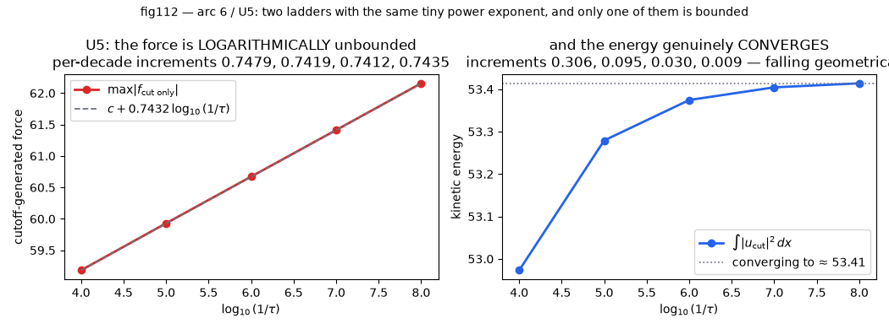

# Arc 6 — Adjudicated: reading the claim, compiling nothing, and asking our own wall

**Technical note. Arc 6 is the arc that delivers a result of its own.**

| | |
|---|---|
| **Date** | 2026-09-09 |
| **Mode** | `ORCHESTRATION.md` **§3f SOLO** — one instance, no subagents, no Decision Maker, no paired verifier |
| **Legs** | 417–422 |
| **Curated data** | [`arc6_acquire_v1`](../data/arc6_acquire_v1.json) · [`arc6_lean_v1`](../data/arc6_lean_v1.json) · [`arc6_skeleton_v1`](../data/arc6_skeleton_v1.json) · [`arc6_instantiate_v1`](../data/arc6_instantiate_v1.json) · [`arc6_w4_port_v1`](../data/arc6_w4_port_v1.json) |
| **Evidence** | [`adjudicated_evidence.py`](adjudicated_evidence.py), which runs all five unit checks and rebuilds every number below |
| **Narrative companion** | [`BLOG_ADJUDICATED.md`](BLOG_ADJUDICATED.md) |
| **Verification** | **EVERY GATE IS `UNVERIFIED`.** §3f rule 1: verification is a fresh session or it is not verification. One session measured all of this and wrote its own answers. |
| **Clay movement** | **NONE.** No `L1 → L4` link moved. Clay stays ~0.05%. Tier 2 is never a proof. |

---

## 0. What arc 6 was asked, and what it answers

The charter set two questions:

> **(A)** Is the claimed result correct, on our own reading and our own compile?
> **(B)** Does its residual-absorption mechanism move `W4`, our own named wall, under `W4`'s **own**
> pre-committed test — or measurably fail to, and why?

**(A) is answered in part and the parts are kept apart.** The *statement* is adjudicated at
primary; the *proof* is not, and no session here claims otherwise. **(B) is answered in full, and
the answer is `NO` with five measurements behind it.**

**One thing this note refuses to do.** A 166-page manuscript was read at §§1–3 and §10, and a
2,486-file Lean project was censused but **not compiled** — the build is blocked on a host this
environment denies. **Neither of those is an opinion about whether the manuscript is right.** The
sections below say what was measured and stop there.

---

## 1. `U1` — the theorem, at primary

**Gate: is the theorem as reported in arc 5 the theorem the manuscript states?**
## **`DIFFERS-AS-FOLLOWS`**

Four objects were fetched and hashed here: the **166-page** manuscript
(`sha256 0e779481c4da40bd…`), OpenAI's **57-page** Euler companion (`a0c234518e6c489e…`),
Fefferman's Clay statement (`c1b5f27b1a64705c…`), and the Lean project at HEAD
`8937a8f4cbc7abaab5e9e97d1cc7f5d2319d9538` (2,486 `.lean` files, 32.4 MB).
**Every quotation was cut from the PDF text layer by string anchor, never typed** — the leg-414
channel hazard (`writeup/SOURCES.md`) makes a typed "verbatim" quotation untrustworthy by default.

**Eight agreements**, checked verbatim: the alternative is **(C)**; the domain is `ℝ³`; the datum
is rest; the force is `f ∈ C∞_c(ℝ³ × (0,∞); ℝ³)`; the energy is uniformly bounded before the
singular time; 166 pages; the Lean URL; **`review: status: "self-assessed"`**.

**Seven differences.** The one with reach is **`D3`**:

> arc 5 banked *"(A) and (B) are untouched. The unforced problem is open. **So is (D)**."*
> Theorem 1.1 ends: *"Compact support also yields the corresponding construction on `T³ = ℝ³/ℤ³`,
> **establishing alternative (D)** in [13]; see Corollary 10.6."*

**`(D)` is claimed**, as a corollary, in the same document, for every `ν > 0`. `WALLS.md` `W4`'s
**only unbroken break clause is (c)**, and **clause (c) is statement (D)**. This does not make the
claim true; it makes `TECHNICAL_OUTPACED.md` §5's A6-D premise — *"(D) is the nearest **unclaimed**
Fefferman statement"* — **false on the manuscript's own text**. **It is not a ruling on Lane T**,
whose deferral is a user ruling and whose escalation packet is unruled.

**`D2`** is the one that governs everything after: Theorem 1.1 asserts a compact `K ⊂ ℝ³` with
`supp u(·,t) ∪ supp p(·,t) ⊂ K` for **every** `0 ≤ t < 1`. **The solution and the pressure are
compactly supported in space, uniformly in time** — arc 5 recorded no support property at all.
Fefferman **(4), (5), (7), (8)** and **(9)** are then discharged **by containment**, and not one of
the five by a decay estimate.

**A discharged debt.** `STATE.md` Open item 3 said Fefferman **(8)** and **(9)** were `UNREAD`.
They are now read at primary: **(9) asks the force for decay in TIME ONLY** and explicitly replaces
(4) and (5). This **confirms leg 390's machine-read at primary** — (D) carries no condition (7).

---

## 2. `U2` — the Lean, measured not assumed

Four clauses, answered separately.

### (a) Does it build? **`NOT-ESTABLISHED`, with the blocker measured and named**

**`mathlib4.blob.core.windows.net:443` is denied by this environment's egress policy** —
`connect_rejected`, *"gateway answered 502 to CONNECT"*, from the agent proxy's own record. That is
the **mathlib olean cache**, so `lake exe cache get` has nothing to serve and **mathlib compiles
from source before one line of the project is elaborated.** The host was **reported, not routed
around**. A second, *different* failure is banked beside it — a relay timeout mid-clone
(`ws_closed_mid_exchange`, 461,265,558 B received) that succeeded on retry — so a future reader
cannot merge a permanent denial and a transient reset into *"the build did not work"*.

Everything else installs clean: `leanprover/lean4:v4.34.0-rc2` (lean commit
`6a10ac8c22beadecabdbb0919c2b50214762f91d`), Comparator at its pinned revision, **no configuration,
manifest or toolchain error at any point.**

### (b) Is it the paper's theorem? **It is Fefferman (C) and (D) exactly, and strictly weaker than Theorem 1.1**

**The definitions are not OpenAI's.** Google DeepMind's *Formal Conjectures* file was fetched here
at the commit the project pins (`8bf45ed70d48b2b2a501de9c00b26bfa38c573ee`, 296 lines,
`sha256 f446284f2aa54375f558c263a580b34e2e7bc9f44a28829637199cc72257d25d`) and diffed. **Every
difference is namespace, notation or attribute; every definition and both breakdown statements are
character-for-character identical.**

That matters because **the commonest way a formalisation is *true but not the theorem* is a
self-authored encoding that quietly weakens a hypothesis.** That failure mode is excluded here, and
the exclusion was checked at the upstream source rather than taken from the header comment that
asserts it. Six quantifier rows against Fefferman at primary, **all MATCH**.

**Weaker in a precise sense.** Theorem 1.1 asserts six things; the top-level Lean statement asserts
**only the non-existence clause**. Four of the other five are proved elsewhere in the project. And
**`NavierStokesR3.ProblemStatement.breakdownStatement` — the project's own transcription of Theorem
1.1 with every clause bundled — is defined and never proved**, as its own docstring says.

**A structural difference:** in the Lean the **periodic** object is primary and `ℝ³` is derived by
localisation; **in the manuscript the order is reversed.**

### (c) Sorry-free and axiom-free? **Yes at source level. Not established at kernel level.**

Over the project's own 2,486 tracked files: **5 `sorry` occurrences — 4 proof placeholders and 1 in
a docstring's prose — all five in `ComparatorChallenges/`; 0 `axiom`, 0 `native_decide`, 0
`unsafe`/`partial`/`@[implemented_by]`/`@[extern]`, 0 `opaque`.**

**Excluding `.lake/` is stated, not silent:** the dependency tree holds **29 `sorry`s and 6
`axiom`s**, every one inside `.lake/packages/Comparator/tests/projects/` — the Comparator tool's
own **adversarial test fixtures**. A census that counted those would report a scandal that is not
there.

The project's headers assert the proof root does not import the challenge module. **That was
measured, not accepted:**

| root | modules | lines | `theorem`/`lemma` | `sorry` | challenges in closure |
|---|---|---|---|---|---|
| `NavierStokes.ComparatorSolution` | **580** | 379,522 | **23,604** | **0** | **no** |
| `Euler.Solution` | 1,829 | 210,326 | 10,595 | **0** | **no** |
| `Euler.EulerSingularity` | 1,770 | 203,639 | 10,287 | **0** | **no** |

**73 of 2,486 modules (2.9%) are reachable from no main result.** Four things a source grep cannot
see are named in the artefact, the first being a `sorryAx` smuggled through a *definition* — for
which the Comparator suite ships a fixture.

**A self-correction:** the first `sorry` count was **4**; the evidence script's re-count returned
**5**; the difference is one docstring sentence. **The larger number is banked with the split.**

### (d) What fraction of the paper's argument is formalised? **The theorem fully. The argument, not measurably.**

`formalization.yaml` aligns **four** statements and nothing finer. Below that: **25 distinct
`Theorem/Lemma/Proposition n.m` labels are cited in the Lean; 9 exist in the published
Navier–Stokes manuscript, 1 only in the Euler one, and 15 exist in NEITHER.**

**The published manuscript has ten numbered sections and no Section 11**, yet the Lean cites
`Lemma 11.3`, `Proposition 11.4`, `Proposition 11.7`, and titles a module *"the whole-space
assertion of **Part II**, Theorem 1.1"*. The sources say *"the candidate manuscript"* throughout.
**The Lean was developed against a different draft** — unremarkable for a formalisation built
alongside a paper, **and not an accusation of anything.** What it means is exact: **a lemma-by-lemma
alignment between the published 166 pages and the 2,486 Lean files cannot be read off the project,
and this arc does not manufacture one.**

**Two numbers, because one would be a lie.** Of the paper's **theorem**: **100%**, subject entirely
to (a) and to the kernel half of (c). Of the paper's **argument**: **not measurable** — at most
**9 of 73** numbered results (**12.3%**) are even *named*.

---

## 3. `U3` — where the residual is discharged, and what compact support costs

**Gate: is `TECHNICAL_OUTPACED.md` §2 right?** ## **`PARTLY`**

`solver/arc6_residual_ledger.py` carries every scaling as `a + b·h` over `Fraction`. **All 23
re-derived quantities equal the values the manuscript prints — exact equality, not agreement to a
tolerance.** Two are *solved* rather than transcribed: `u_r`, and `A_wave`, obtained by requiring
the cancellation and solving, whereupon the printed `q^{-1/2-h/2}` falls out.

**The residual is discharged in three places, at three orders**, and conflating them is what makes
the mechanism sound either trivial or miraculous:

| # | what | by what | where |
|---|---|---|---|
| 1 | the leading annular stress divergence, `q^{-3/2-h}` | the pulses' averaged **Reynolds stress** | §3.3, Props 7.5 / 9.5 |
| 2 | **everything else**, including what each correction itself creates | the four-operation cycle, `σ_j = 1/5 + j/10 → ∞` | §3.4, Props 9.6 / 9.9 |
| 3 | the **entire remaining residual of the localized fields** | **it is DEFINED to be `f`** | §3.5, one sentence |

**Discharge 2 is the real work: after 1 the residual is still unbounded; 2 makes it FLAT, and
flatness is what makes 3 legal.**

**Clause 1 of arc 5 §2 — the forcing buys the escape — is RIGHT**, and the line that settles it is
*"For `t < 1`, we set `f = R(u,p)`."* **Clause 2 — "(5) discharged at no analytic cost" — is right
about (5) and wrong if read as "compact support is free".** (5) costs **three lines**; having a
compactly supported *smooth* `f` costs Theorem 3.1(iii)'s flatness estimate, which is §§4–9 plus
Appendices A–C: **131 of 166 pages, 78.9%.**

**On leg 381 — a SPLIT, not a reversal.** Its *"buys no escape"* is **wrong** and arc 5 was right to
flag it. Its *"not a shortcut"* is **right**, and arc 5's table loses it. The charter offered a
sentence to be said in exactly those words if leg 381 was right and arc 5 wrong: **it does not
apply and it is not said.**

---

## 4. `U4` — instantiate, and a defect in this arc's own pre-registration

**Gate: does the measured residual scale as the construction requires?**
## **`YES` on the measured question — and the pre-committed conjunction is NOT met.**

`P0` measures **`−1.498218`** against a pre-committed **`−1.51`**: `|err| 0.011782` inside the
pre-committed tolerance `0.05`, three-level spread **`2.11e-07`**, six orders under the
pre-committed `0.025`.

**But control `C2` failed against its pre-committed prediction, and it failed because the
pre-registration's own formula was wrong.** `−max(A+1, 2A+D)` **omits axial diffusion**,
`q^{−(A+2D)}`, which is subdominant *exactly at the design point* (`1.49 < 1.51`) and dominant as
soon as `D > 1/2`. Against the corrected formula `C2` lands at `|err| 0.000972`.

**The conjunction is reported UNMET rather than re-scored.** Re-scoring a pre-committed control
after seeing the number is what a pre-registration exists to prevent; everything from the corrected
formula is labelled **post-hoc** and the evidence script checks it is excluded from the gate.

**The offsets are subleading contamination, and that was predicted before it was checked:**
restricting the fit to the last three decades must move every exponent **toward** its prediction.
**Every case moved toward. None moved away.**

**A condition this unit does not meet, measured and banked:** the manuscript's exterior moment
identities fail here, and `∫r²R_θ dr` has `|·|` ratio **exactly 1.0000** — `R_θ` has **one sign**,
so no amplitude cancels its moment. The cancellation must come from the profile construction
(Appendix A), which this unit does not reproduce and never claimed to.

---

## 5. `U5` — does `W4` move?

**Gate: does `W4` break under its own test?** ## **`NO`.**

Answered against `WALLS.md`'s own clause (a), quoted not paraphrased, and the evidence script
checks the banked clause is a **substring of `WALLS.md`** so a paraphrase would fail.

**Every advantage was granted, deliberately:** `p ≡ 0` (smooth, and free since `f` absorbs it);
`f :=` whatever is left, so `(u_cut, 0)` solves forced Navier–Stokes **exactly** at every `τ > 0`;
the cutoff on the **vector potential**, as the manuscript's §3.5 does, so `∇·u_cut = 0` by
construction. **A `NO` cannot be blamed on the setup.**

| clause | verdict | on what |
|---|---|---|
| **(a1)** bounded energy | **TRUE** | energy **converges to ≈ 53.41**; increments `0.306, 0.095, 0.030, 0.009`, ratios `0.311/0.314/0.315` |
| **(a2)** still blows up | **TRUE** | **by construction, not measured, and labelled so** |
| **(a3)** `f` admissible | **FALSE** | **twice, independently** |

**First failure — route 4's own object.** `M1` core residual exponent **`−1.500000`**, three-level
spread **`3.47e-07`**, against a pre-committed `−1.500`. `f` diverges like `τ^{-3/2}` **where the
cutoff is identically one.** The reason was written down before the run: route 4 **has no exact
profile** (`L6`: `ρ = 1.5048519` at 20,000 iterations against `< 1.45`). **That is a fact about
route 4, not about the wall.**

**Second failure — the counterfactual, and the finding with reach.** Granting the core residual to
be zero, the **cutoff-generated force alone is logarithmically unbounded**:

| per-decade increments of `max\|f_cutonly\|` | **`0.7479, 0.7419, 0.7412, 0.7435`**, spread `6.6e-03` |
|---|---|
| log fit `f = c + b·log₁₀(1/τ)` | `b = **0.743203**`, `R² = **0.9999976208**` |
| power fit | `−0.005321`, `R² = 0.9999292516` |

So **`∂_t f = b/(τ ln 10)` diverges like `τ^{-1}` exactly**, and `f ∉ C∞_c(ℝ³×(0,∞))`, failing
Fefferman **(5)**. **A power fit alone returns `−0.005321`, which reads as *bounded*.** The
pre-registration **flagged a log in advance** and required the per-decade increment to be reported;
**that requirement is what caught it** — the third time this repository has met the signature
(§52–§54, `PB2`). **The same classifier applied to the energy shows its increments FALL
geometrically**, so `(a1)` is genuinely true; a power exponent alone would not have separated them.

`M6`'s direct stencil is **`UNDER-RESOURCED`** (spread `0.857` against `0.025`) with the cause
measured, and **the conclusion is not drawn from it**: its coarsest level reads `−0.998616` and the
log fit predicts exactly `−1`, agreeing to `0.0014` by an independent route.

**fig112** — the two ladders side by side. Both return a power exponent of about `−0.005` and
`−0.0008`; **only one of them is bounded.** Left: `max|f_cutonly|` against `log₁₀(1/τ)`, a straight
line — increments `0.7479, 0.7419, 0.7412, 0.7435`. Right: the kinetic energy, whose increments
**fall geometrically** to a limit near `53.41`. Rebuilt from
[`arc6_w4_port_v1.json`](../data/arc6_w4_port_v1.json) by
[`adjudicated_evidence.py`](adjudicated_evidence.py), which asserts both shapes and exits non-zero
if either drifts.

**Two measurements worth banking in their own right.** **`α = −1.000004`** on two rays — an
**independent confirmation of the `α = 1` pin to `4e-6`**, by a route sharing no step with
`L2′`/`V-W4`'s literature census. And **`δ = 1.974126`**, the far-field **correction** exponent,
**never measured here before**.

**Not established:** that every `α = 1` profile does this. The log traces to `arcsinh` in this
witness's own `G4`. **What IS structural:** `α = 1` makes the annulus values `τ`-independent at
leading order, so **admissibility there reduces entirely to the profile's subleading far-field
term** — a question about the profile, and measurable.

**And that is exactly what the manuscript avoids.** It never cuts an exact profile: it builds an
approximate solution with a **flat** residual, derivative bounds up to `τ = 0` away from the origin,
and an **exactly solved heat exterior**. Those three are what give the annulus terms limits at
`t = 1`. `U3` priced them at **78.9% of the manuscript**.

**No escalation is raised.** The charter reserves one for a `YES`. **`W4` STANDS.**

---

## 6. What arc 6 establishes, and what it does not

**Establishes:**

1. The manuscript's **statement** is Fefferman **(C)**, and it claims **(D)** as a corollary —
   at primary, with hashes.
2. The Lean project's **top-level statement is (C) and (D), byte-identical to an independent third
   party's formalisation**, and its 580-module closure is `sorry`-free at source level.
3. The residual is discharged in **three** places, and **flatness — 78.9% of the manuscript — is
   what buys the compact support**, not the cutoff.
4. The residual scaling is **`−1.498218`** against a pre-committed **`−1.51`**.
5. **`W4` does not break**, and the reason is measured twice: an exact `−1.500000` on route 4's own
   object, and a **logarithm** on a counterfactual that grants an exact profile.

**Does not establish:**

- **That the manuscript's proof is correct.** §§4–9 and Appendices A–C were **not read**. The
  Lean was **not compiled** — the build is blocked on a denied host and the block is measured.
- **That the manuscript's proof is wrong.** Nothing here points that way and nothing here should be
  quoted as if it did.
- **That no localisation argument exists.** `W4`'s own statement is *"no known method"*, and a
  measurement cannot upgrade that to *"no method"*.
- **Anything about statement (D) as a target.** That is Lane T's, deferred by a user ruling.

## 7. Movement

| | |
|---|---|
| Walls moved | **none** — `W4` stands, `W2`/`W3` untouched |
| `L1 → L4` links moved | **0** |
| Clay odds | **~0.05%**, unchanged |
| Tier | no tier produced; the programme's ceiling is Tier 2 and is unchanged |
| Verification | **every gate `UNVERIFIED`** — §3f rule 1 |

**The one thing arc 6 has that no prior arc did: a gate answer about somebody else's claim, taken
at primary, with the parts kept apart.** The statement is adjudicated. The proof is not. Saying
which is which is the result.
