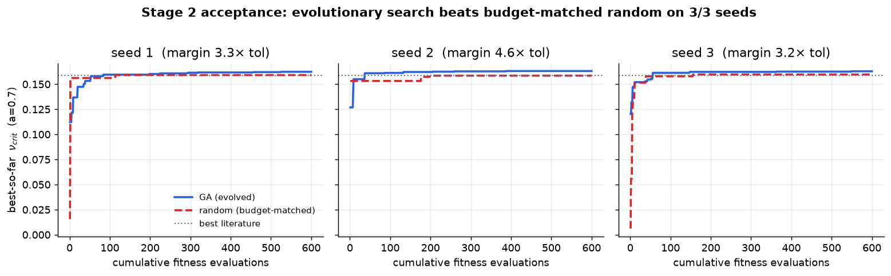
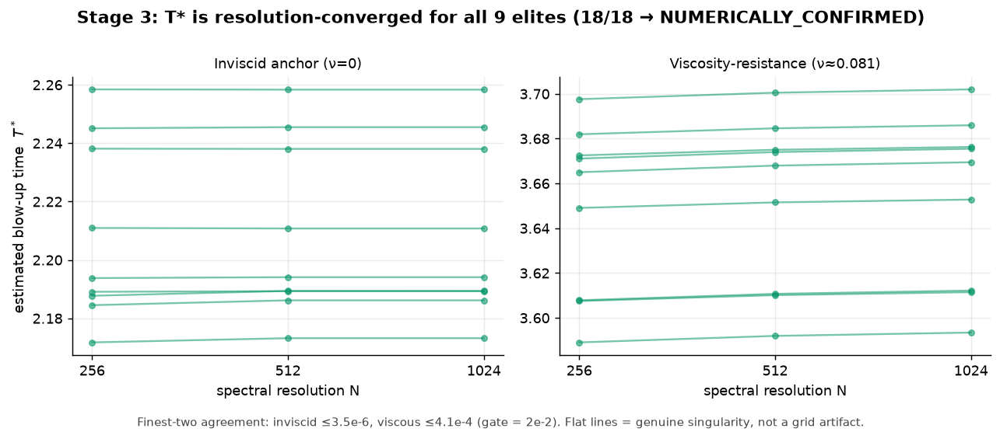
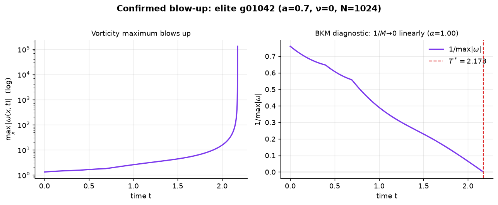
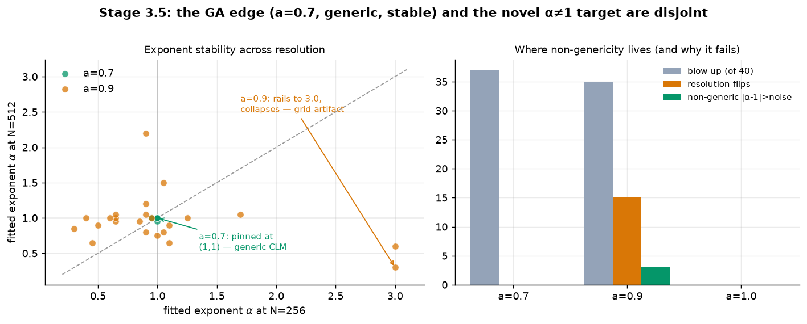
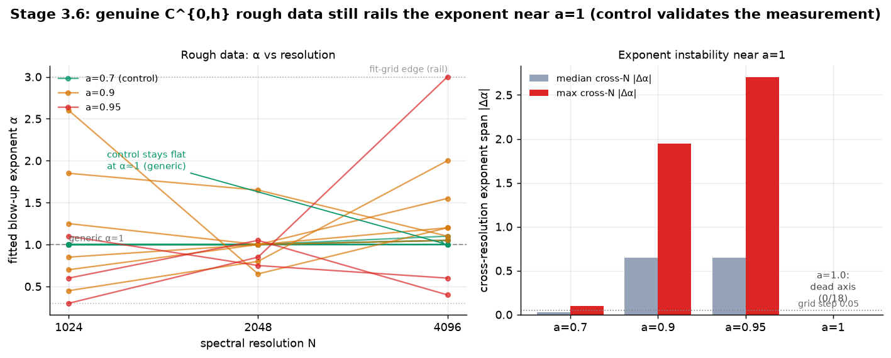

# Can you *evolve* a Navier–Stokes singularity? Notes from a search that tried not to fool itself

*A technical blog post on a small, honest attempt at a very large problem.*

The 3D incompressible Navier–Stokes equations are the equations of ordinary
fluid flow — water in a pipe, air over a wing. One of the seven Clay Millennium
Prize problems asks a question that sounds like it should already have an
answer: starting from *smooth* initial data, do the equations stay smooth
forever, or can the vorticity become infinite in finite time — a "blow-up"?
Nobody knows.

There are two ways to win. Prove regularity (smooth forever), or exhibit a
counterexample (smooth data that blows up). Proving regularity is a universal
statement over an infinite-dimensional space of inputs — you cannot *search*
your way to it. But a counterexample is a single object. And searching for a
single good object is exactly what evolutionary algorithms are for. So: could a
genetic algorithm *evolve* an initial condition toward blow-up?

This post is about actually trying — on a tractable model first — and, more
importantly, about the discipline required so that "my simulation looks like
it's blowing up" never gets mistaken for "I solved a Millennium problem."

## The one rule: don't fool yourself

Here is the trap that sinks naive versions of this project. Numerically, a
singularity means some quantity racing to infinity. But a *coarse grid* also
makes quantities race to infinity — not because the physics is singular, but
because the simulation has run out of resolution. The two look **identical** on
a single run. If you reward your GA for "biggest blow-up signal," you will
faithfully evolve the initial conditions that best exploit your grid's numerical
artifacts, and celebrate a discovery that is really a bug.

So before writing any solver code, we wrote down a contract with three tiers,
and the rule that **only the top tier counts**:

- **Tier 1 — Candidate.** One run shows the textbook signal: track
  `M(t) = max|vorticity|`, and if `1/M(t)` heads for zero at some finite time
  `T*` along a clean straight line, that's a candidate. (This is the standard
  Beale–Kato–Majda reciprocal-vorticity diagnostic.) Cheap — and cheap to fake.
- **Tier 2 — Numerically confirmed.** Rerun the candidate at finer and finer
  grids. If it's a real singularity, `T*` **stops moving** as you refine. If
  it's a grid artifact, `T*` keeps drifting. This is the artifact filter.
- **Tier 3 — Proven.** A rigorous computer-assisted proof. *Only this answers
  Clay.* We don't attempt it.

Everything below lives at Tiers 1–2, on a 1D model. That's the honest framing,
kept front and centre.

## A 1D stand-in with a viscosity knob

Full 3D is far too expensive for a GA that needs thousands of evaluations per
generation. So we use the **generalized Constantin–Lax–Majda (gCLM)** family — a
1D equation that captures the vortex-stretching mechanism believed responsible
for blow-up, with two dials:

- an **advection** dial `a`: at `a=0` (plain CLM) there's a *known closed-form
  blow-up*, perfect for validating the solver; at `a=1` (De Gregorio) whether
  smooth data blows up is genuinely subtle and still researched.
- a **viscosity** dial `ν`: viscosity is the thing that might save 3D
  Navier–Stokes from blowing up, so we bake it in from the start rather than
  studying only the frictionless cousin.

The fitness we evolve toward is deliberately *not* "blow up fastest." It's
**`ν_crit`: the most viscosity a shape's blow-up can survive.** Resistance to
the regularizing force is the property that would actually matter for the real
(viscous) equation.

## Getting the fitness wrong twice (which was the point)

The first fitness axis failed — informatively. At `a=0`, the way to survive the
most viscosity is boringly trivial: dump all your energy into the lowest
Fourier mode, which the `ν·k²` dissipation barely touches. Random sampling finds
that optimum instantly; there's nothing for evolution to *do*. A second family
of redesigns failed the same way. Each failure taught us to demand more of a
fitness axis before spending compute on it, and we distilled that into a
**six-property gate** — the punchline being a *non-trivial optimum*: the best
random draw must sit clearly below what structure can achieve.

The axis that finally passed: `ν_crit` at **`a=0.7`**. With advection turned up,
the cheap low-frequency refuge stops paying — surviving viscosity now *requires*
genuine evolved structure. That's a fitness landscape a search can climb.

## Result 1: the search genuinely beats random

The acceptance test is stricter than "beats random" — it's **budget-matched**.
Give random search the *same number* of evaluations as the GA and compare
best-so-far curves at equal cost (otherwise the GA's thousands of tries beat
random's hundreds by pure luck-of-the-draw). Across three independent seeds, the
GA wins every time, by 3–5× the measurement tolerance, and beats the best known
literature profile on every seed while random never does.

The gains came from mutation and crossover, not luckier random draws, and
independent runs converged on substantially the same map of which shapes resist
viscosity. Evolution is doing real work here.

## Result 2: the blow-ups survive the artifact filter

Then the important part — Tier 2. We took the nine best evolved shapes and reran
each at N = 256, 512, 1024 grid modes, pushing the growth across four decades.
If these were grid artifacts, the predicted blow-up time `T*` would wander as we
refined. It doesn't:

All eighteen studies (nine shapes, inviscid and viscous) converge — the two
finest grids agree to within a few parts in a *million* against a 2% bar. The
conservation-drift artifact guard *shrinks* as we refine, the opposite of an
under-resolved run, and the best shape gives a bit-identical `T*` at N=2048.
Here's one, showing the classic signature — vorticity racing up, `1/M` falling
to zero along a line:

By our own contract, these are **numerically confirmed (Tier-2)** finite-time
blow-ups.

## The honest asterisk, and a negative result that mattered

Before anyone gets excited: every one of these blow-ups has exponent **α = 1** —
the *generic* CLM singularity, merely surviving some advection. That's
known-type behaviour, not a new discovery. The genuinely novel, proof-worthy
target would be a **non-generic (α ≠ 1)** De Gregorio-type singularity.

So we asked, cheaply, whether our search could be pointed at *that*. It can't —
and the way it fails is instructive:

Where the GA has its edge (`a=0.7`), every blow-up is generic (α = 1), for
rough and smooth shapes alike — the left cluster pinned at (1,1). Non-genericity
only switches on near `a=1`, and there it's a mirage: the exponent rails to 3.0
on a coarse grid and collapses to 0.3 on a finer one (the scattered orange
points). It's a resolution artifact, exactly the thing Tier 2 exists to catch —
now caught at the fitness-design stage, for two minutes of compute, before a
single GA generation was wasted on it. The regime where our search works and the
regime where a novel result lives are **disjoint**.

That's a real finding, and it's the kind you only get if you build the honesty
in from the start.

## One more cheap experiment: what if the data is genuinely rough?

There was still a loophole. Everything above used *smooth* initial data. But the
theorems that actually *prove* non-generic blow-up for these models (Elgindi,
Chen–Hou, and others) don't use smooth data — they use **rough** data:
velocities that are continuous but have a sharp corner, only "Hölder"
differentiable. Our earlier shapes couldn't represent that. Maybe the novel
singularity was hiding behind the wrong kind of input.

So we built the right kind. A vorticity profile `sign(sin x)·|sin x|^h` has a
genuine, localized cusp whose sharpness is set by a knob `h`: at `h=1` it's the
smooth sine wave, and as `h` drops toward 0 it becomes rougher and rougher —
continuous, but with a derivative that blows up right at the cusp. We unit-tested
that it really has the intended roughness (the cusp's exponent comes out equal
to `h` to three decimals; the derivative genuinely diverges as you refine the
grid). Then we ran it near `a=1` at resolutions up to **4096 grid points** — the
finest in the whole project — and watched the blow-up exponent.

Here's the discipline that makes the answer trustworthy: we included `a=0.7` as a
**control**, because we already know the answer there (generic, α=1, rock
stable). If our fine-grid measurement couldn't reproduce a known answer, we'd
have no business trusting it on the unknown one.

It reproduces the control perfectly — the green lines sit flat on α=1 across a
fourfold change in resolution. And near `a=1`, with genuinely rough data, the
exponent still **rails**: it scatters between runs, one shape shoots to the grid
edge at 3.0, and at `a=1` (De Gregorio proper) nothing blows up at all — not even
the roughest data we can build. The tell that this is real and not just an
under-resolved mess: the conservation-drift artifact guard stays five times
*below* its threshold the whole time, and every individual fit is clean. The runs
are fine; the exponent simply has no stable value to converge to. Going to the
finest grids in the project didn't help — which is about as strong as
"this route is exhausted" gets on a 1D model.

Rough data *did* make more shapes blow up — so the new representation is doing
something. It just doesn't produce the one thing we were hunting: a *stable*
non-generic exponent. That closes the cheap route for smooth **and** rough data.
But the two tools it produced — a real rough-data profile, and a fine-grid
exponent measurement validated against a known answer — are exactly what the next
model (2D, where these blow-ups are actually provable) will need. A negative
result that hands you your next instrument is a good trade.

## What this is

A validated 1D solver; an evolutionary search that provably beats budget-matched
random on a meaningful viscous-blow-up fitness; resolution-confirmed candidates;
a reproducible map of which shapes resist viscosity — and a clear-eyed account
of the two walls between all of that and the actual Millennium problem (a search
can only ever argue *for* blow-up, and the only place blow-up is *provable*
today is simple models, not 3D Navier–Stokes). Overall odds of cracking Clay
this way stay around 0.05%. The win we can actually bank is the pipeline, the
map, and the negative results — every number here rebuildable from committed
data, no re-runs required.

The Millennium problem is safe. But the machine for hunting it, and for refusing
to lie to itself about what it finds, works.

*Full technical account: [TECHNICAL_WRITEUP.md](TECHNICAL_WRITEUP.md).
Where the search goes next: [../CLAY_ROADMAP.md](../CLAY_ROADMAP.md).*
